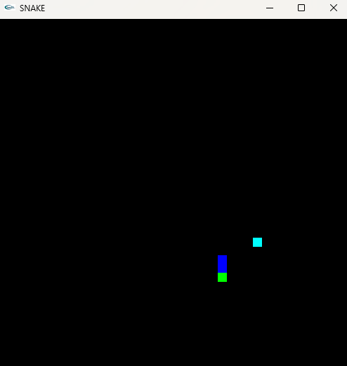
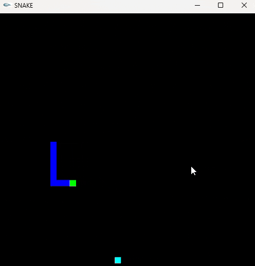
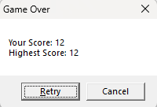

# 🐍 2D Snake Game - OpenGL Project 🎮  

A classic **2D Snake Game** built using **C++ and OpenGL (GLUT)**. This project features real-time movement, food generation, collision detection, and score tracking, making it an exciting game to play!  

---

## 🎮 Game Preview  
<p align="center">
  
</p> 

---

## ✨ Features  
✅ **Smooth Gameplay** – Control the snake using arrow keys  
⏸️ **Pause & Resume** – Press **F1** to pause/resume the game  
🏆 **Highest Score Tracking** – Saves the highest score automatically  
🟥 **Collision Detection** – Game over if the snake hits the wall or itself  
🍏 **Random Food Placement** – Snake grows upon eating food  

---

## 📸 Screenshots  

### 🎮 Game Running Preview  
<p align="center">
  
</p>  

### 💀 Game Over Screen  
<p align="center">
  
</p>  

---

## 🚀 Getting Started  

### 📌 Prerequisites  
- **OpenGL (GLUT) installed** on your system  
- **CodeBlocks IDE** (Recommended for running the project)  

---

### 🔧 Installation & Running the Game  

#### 1️⃣ **Download & Install OpenGL (GLUT)**  
- On Windows, download **freeglut** and place the required `.dll` files in `C:\Windows\System32`  
- Ensure **CodeBlocks** is configured with OpenGL  

#### 2️⃣ **Clone the repository**  
```sh
git clone https://github.com/mdnurnabirana/2D-Snake-Game-OpenGL-Project.git
cd 2D-Snake-Game-OpenGL-Project
```

#### 3️⃣ **Open the Project in CodeBlocks**  
1. Open CodeBlocks  
2. Click **File → Open**  
3. Select the **2D-Snake-Game-OpenGL-Project** folder and open the project  

#### 4️⃣ **Build & Run**  
1. Click **Build → Run**  

---

## 🎮 Controls  

| Action          | Key         |
|----------------|------------|
| Move Up        | Arrow Up    |
| Move Down      | Arrow Down  |
| Move Left      | Arrow Left  |
| Move Right     | Arrow Right |
| Pause/Resume   | F1          |
| Exit Game      | ESC         |

---

## 📂 Project Structure  
```bash
📦 2D-Snake-Game-OpenGL-Project  
 ┣ 📜 main.cpp        # Main game loop & rendering  
 ┣ 📜 game.cpp        # Snake logic, food, and collision detection  
 ┣ 📜 game.h          # Header file with global variables and function prototypes  
 ┣ 📜 README.md       # Project documentation  
 ┣ 📂 images/         # Screenshots & game images  
```

---

## 🤝 Contributors  

| Name                | Email                           |
|---------------------|--------------------------------|
| Md. Nurnabi Rana   | 📧 mdnurnabirana.cse@gmail.com |
| Sabrina Akter      | 📧 sabrinaakterchy.cse@gmail.com |
| Soumitra Dey Dipon | 📧 soumitradev532@gmail.com       |

---

## 🏆 Credits  
Built by [mdnurnabirana](https://github.com/mdnurnabirana) 🚀
